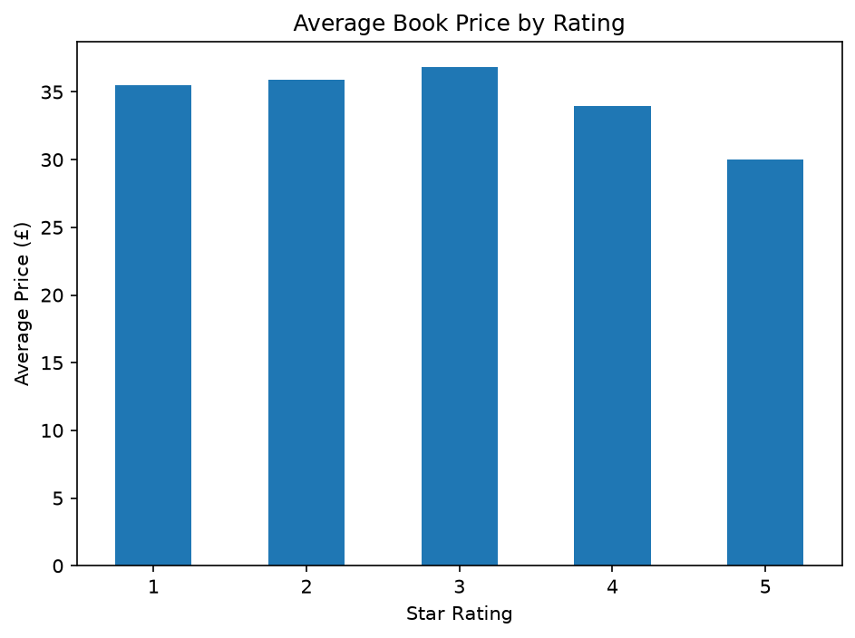
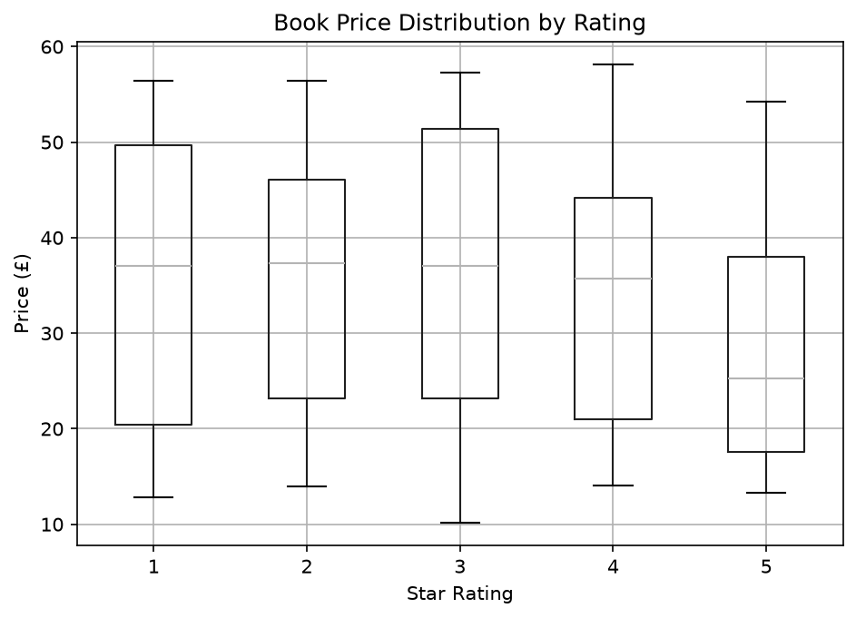
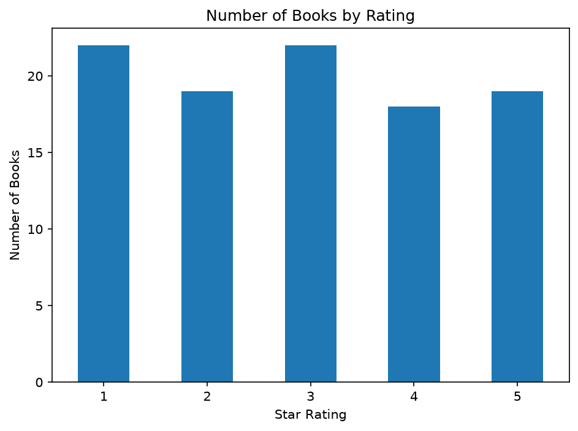

# Book Web Scraping and Price Analysis

## 1. Objective

The goal of this project was to build a small web-scraping pipeline using Python, collect book data from Books to Scrape, clean the resulting dataset, and explore the relationship between book ratings and prices.

The project demonstrates practical skills in web scraping, data cleaning, exploratory data analysis (EDA), data visualization, and version control.

## 2. Data

The data was collected from [Books to Scrape](https://books.toscrape.com/), a website designed for practicing web scraping.

The initial dataset contains 100 books collected from five pages. Each record includes:

* **Title:** The book's title.
* **Price:** The listed price in pounds sterling (£).
* **Rating:** The book's rating, represented as one to five stars.

The raw dataset is saved in `books_raw.csv`, and the cleaned dataset is saved in `books_cleaned.csv`.

## 3. Method

The project followed these steps:

1. Used `requests` to retrieve webpage HTML.
2. Used BeautifulSoup to extract book titles, prices, and ratings.
3. Scraped five pages with a one-second delay between requests.
4. Loaded the raw CSV into Pandas and inspected column types.
5. Removed the currency symbol and converted prices to numeric values.
6. Mapped word-based ratings to numeric values from 1 to 5.
7. Stripped whitespace from titles, checked for duplicate titles, and removed the unnecessary CSV index column.
8. Used Pandas `groupby()` to compare prices by rating.
9. Created charts with Matplotlib and exported them as PNG files.
10. Saved the cleaned dataset and tracked project changes with Git and GitHub.

## 4. Findings

### Finding 1: Higher ratings did not correspond to higher average prices

The average price varied across ratings. Three-star books had the highest average price at £36.84, while five-star books had the lowest average price at £30.01.

### Finding 2: Prices varied considerably within each rating

The boxplot shows substantial overlap in the price distributions across rating groups. Books with the same rating can have quite different prices, suggesting that rating alone does not explain the full variation in price.

### Finding 3: The dataset contains books across all five rating categories

The rating-count chart shows how the 100 collected books are distributed across the five rating categories. These counts describe this sample, not the distribution of all books available on the website.

## 5. Limitations

This analysis covers only 100 books from the first five pages of the website, so the findings may not represent the entire catalog or books sold elsewhere. The analysis is descriptive and does not establish that a book's rating causes its price to be higher or lower.

The dataset also contains only titles, listed prices, and ratings. It does not include other factors that might influence price, such as publisher, format, edition, condition, or book length. Finally, the website is intended for scraping practice, so its data should not be assumed to represent the wider publishing market.

## 6. Conclusion

This project demonstrates an end-to-end data workflow, from collecting raw web data to cleaning, analysis, visualization, and documentation.

Within this sample, five-star books had the lowest average listed price, while three-star books had the highest. However, prices overlapped substantially across rating categories, and the limited sample does not support broad conclusions about the relationship between price and rating.

The project strengthened practical skills in Python, requests, BeautifulSoup, Pandas, Matplotlib, CSV handling, and Git/GitHub.
